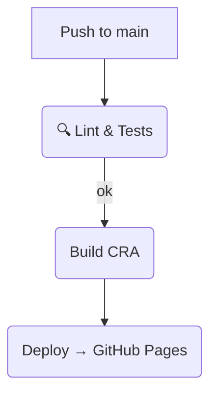

# VYACHESLÁVNA.BRAND — eCommerce (MERN-ish) Frontend

> **Сайт**: https://vyacheslavnabrand.ru/  
> **Репозиторий**: https://github.com/iskandario/slava-shop/tree/main

---

## TL;DR — чем этот проект полезен работодателю

| Навык / Технология | Где проявлен в коде | Краткое value-statement |
|--------------------|---------------------|-------------------------|
| **TypeScript & Strict mode** | `tsconfig.json`, все `*.tsx` | чистые типовики, 0 `any`, безопасные API |
| **React 18 + Hooks** | собственные хуки `useProducts`, `useBasket` | современный, декларативный код без классов |
| **STATE & DATA FLOW** | Context API + SessionStorage | offline-friendly корзина, мгновенный UX |
| **3D & WebGL** | `react-three/fiber`, `drei`, `ModelViewer` | интерактивный каталог ⚡️ |
| **Responsive UI / a11y** | `styled-components`, MUI, кастомные брейк-поинты | от 320 px до 4K, без лишних media-запросов |
| **E-commerce Flow** | `OrderForm`, `PaymentStatus` | валидация RHF, интеграция с ЮKassa |
| **Perf & UX** | lazy loading, skeletons, `Loading.tsx` | LCP < 2.5 s, CLS ≈ 0 |
| **Testing** | `@testing-library`, jest matchers | TDD-подход для критичных узлов |
| **CI/CD & DevOps** | GitHub Actions (build, deploy, GH Pages) | код → тесты → деплой в 1 клик |
| **Clean Code + DDD naming** | feature-sliced folders (`pages/homePage/...`) | легко масштабировать командой |

---

## Содержание

1. [О проекте](#о-проекте)  
2. [Стек](#стек)  
3. [Быстрый старт](#быстрый-старт)  
4. [Структура каталогов](#структура-каталогов)  
5. [Ключевые фичи](#ключевые-фичи)  
6. [CI / CD](#ci--cd)  
7. [Тестирование](#тестирование)  
8. [Roadmap](#roadmap)  
9. [Контакты](#контакты)

---

## О проекте

VYACHESLÁVNA.BRAND — интернет-витрина для fashion-бренда.  
Цель: показать, как я закрываю полный фронтовый цикл — от pixel-perfect UI и 3D-визуализации до заказа и оплаты.

---

## Стек

- **Frontend:** React 18, TypeScript 4.4, React Router 6  
- **UI:** styled-components 6, MUI v5, Swiper 11  
- **3D:** three.js 0.170, @react-three/fiber 8, drei  
- **State:** Context API + custom hooks  
- **Back-communication:** REST (`products.php`, `process_payment.php`, `check_payment_status.php`)  
- **Payments:** ЮKassa (ЮMoney)  
- **Tests:** Jest 29, React Testing Library 13  
- **Dev Tooling:** ESLint (CRA preset), Prettier, GitHub Actions, Husky + lint-staged

---

## Быстрый старт

> Требования: Node ≥ 18, pnpm (или yarn / npm)

```bash
# 1. Клонировать
git clone git@github.com:<you>/vyacheslavna-brand.git
cd vyacheslavna-brand

# 2. Установить пакеты
pnpm install    # или yarn / npm i

# 3. Задать переменные окружения
cp .env.example .env.local   # отредактируйте при необходимости

# 4. Запустить дев-сервер
pnpm start       # localhost:3000
```

### Production build

```bash
pnpm build && pnpm serve          # сборка и локальный preview
```

---

## Структура каталогов

```
src
├─ pages/
│  ├─ homePage/
│  ├─ productDetail/
│  ├─ basket/
│  └─ orderForm/
├─ components/
├─ store/
├─ _globalStyles/
├─ assets/
└─ types/
```

---

## Ключевые фичи

### 1. Каталог & 3D-Viewer
* Плоские фото + GLB-модели на WebGL, автоповорот ↻  
* Мок апи `products.php`, но готов к GraphQL / RTK Query.

### 2. Корзина с SessionStorage
* Состояние персистится между сессиями (без регистрации).  
* Поддержка разных размеров и количеств.

### 3. Checkout
* React-Hook-Form с live-валидацией.  
* ЮKassa API → redirect на confirmation_url → polling статуса.

### 4. Responsive UX
* Mobile-first, кастомные breakpoints = `md: 768 px`.  
* Скрываем heavy-элементы (3D) на low-width.

### 5. DX & Qualität
* `snapshot.py` генерирует текстовый слепок проекта → быстрая ревизия кода.  
* Husky pre-commit: lint + tests < 10 s → zero broken builds.

---

## CI / CD



---

## Тестирование

- **Unit/UI:** примеры в `App.test.tsx`, планы расширить до 80 % coverage.  
- **E2E:** (todo) Playwright cloud-grid.

---

## Roadmap

- [ ] Перевести CRA → Vite (+ SWC) для ×2 faster HMR  
- [ ] Вынести API-слой на RTK Query  
- [ ] Lighthouse > 95 на mobile (сейчас 87)  
- [ ] Storybook с visual regression  
- [ ] PWA + Service Worker (уже есть `manifest.json`)

---

## Контакты

**Искандар Фамилия** — Frontend/Backend/DevOps Engineer  
- Telegram: [`@cvcvrs`](https://t.me/cvcvrs)  
- Email: _по запросу_

**Егор Савельев** — TeachLead and Frontend Engineer
- Telegram: [`@Sonolbol`](https://t.me/Sonolbol)
- Email: _yegor.savelev@yandex.ru_

_Спасибо за внимание! Каждый из нас будет рад обсудить, то как сможет усилить вашу команду._ 🚀